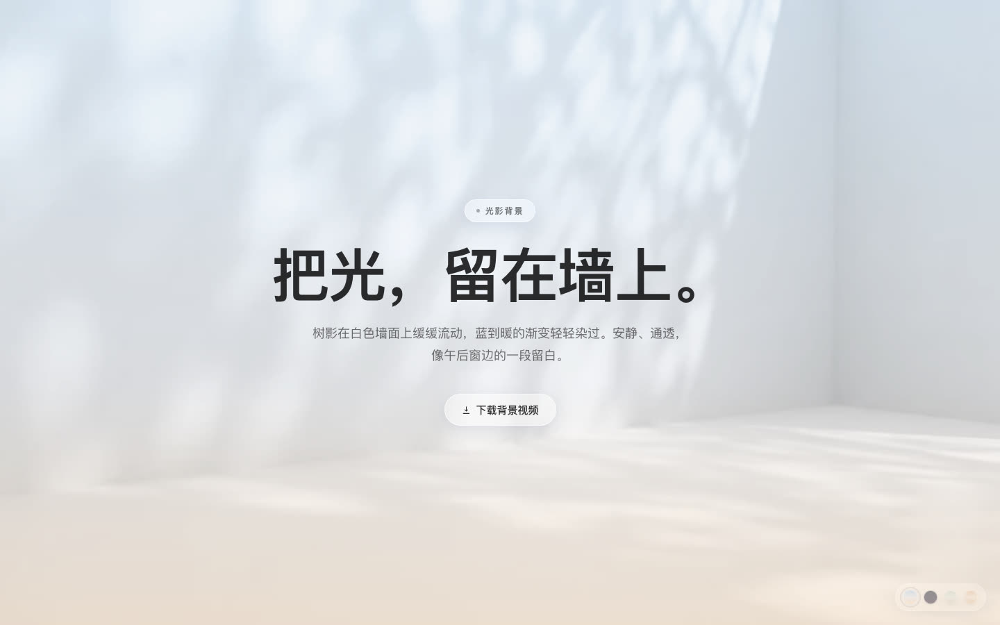
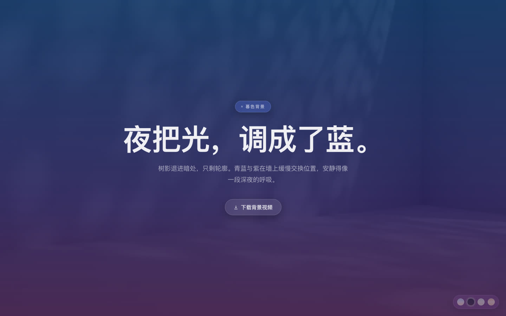
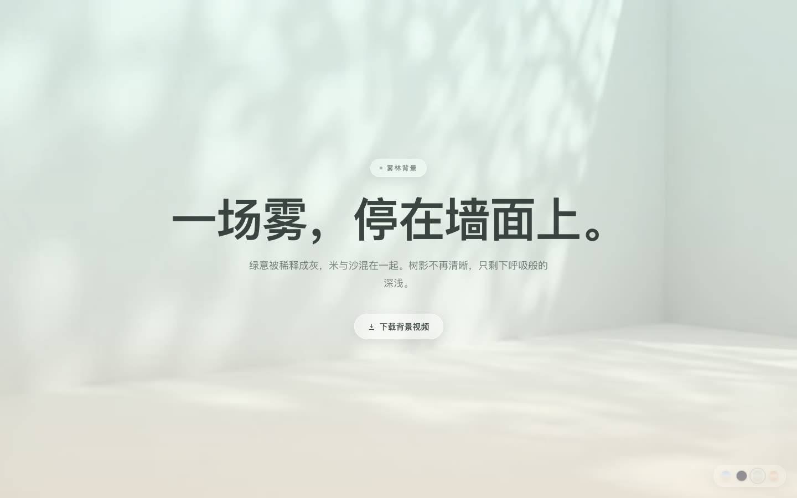
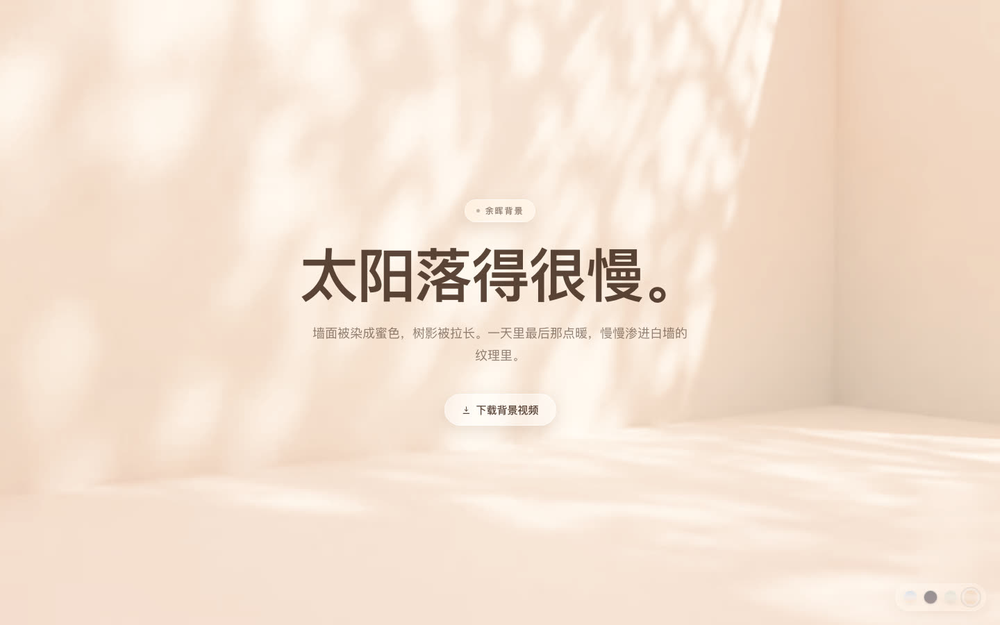

# 光影背景 · 四色主题单页

一个用纯 HTML/CSS/JS 复刻 [today.ai/thanks](https://today.ai/thanks?platform=macAppleSilicon) 背景氛围的单页，并把「白墙树影视频 + 渐变染色」这套叠层玩法拆成了**可换肤的主题系统** —— 单文件、零依赖、零构建。

同一个图层结构，四套气质完全不同的配色：

<p align="center">
  
  
</p>
<p align="center">
  
  
</p>

## 背景原理

那面白墙看起来像「贴了层渐变」，其实是 **5 层叠加**的结果。少任何一层，通透感就没了：

| # | 图层 | 实现 |
|---|---|---|
| ① | 静态渐变打底 | `linear-gradient(180deg, ...)`，随主题变化 |
| ② | 背景视频 | 白墙树影，`object-fit: cover` + `object-position: center top` |
| ③ | 海报图层 | 视频 `playing` 后 1000ms 淡出，做 crossfade 避免闪黑 |
| ④ | **染色层** | 同款渐变 @50% 左右透明度 + `mix-blend-mode: color` |
| ⑤ | 薄纱 | 半透明色纱，把整体压柔（浅色主题用白、深色主题用近黑） |

**关键在第 ④ 层。** `mix-blend-mode: color` 只取渐变的**色相与饱和度**，保留视频的**明度**。所以白墙不是被盖了一层半透明色块，而是真的被「染」成了蓝→暖 —— 树影的明暗层次一点没丢。这才是它看起来通透而不假的原因。

> 注意：`mix-blend-mode` 需要在父容器加 `isolation: isolate` 建立独立层叠上下文，否则混合会溢出影响其他元素。

## 主题

四套主题共用同一套图层结构，只换 CSS 变量。文案也跟着主题走（换肤时整个氛围一起变），不想要可以固定住，见下方「自定义」。

| Key | 名称 | 气质 | 打底渐变 | 视频调色 |
|---|---|---|---|---|
| `dawn` | 晨曦 | 原站配色，冷蓝 → 白 → 蜜桃 | `#ACCDEC → #E7EBF4 → #FFDDB9` | 无 |
| `dusk` | 暮色 | 深蓝紫黑 + 青蓝紫，夜空感 | `#0B1020 → #171A33 → #2A1E33` | `brightness(.38) saturate(.92) contrast(1.06)` |
| `mist` | 雾林 | 莫兰迪灰绿，安静高级 | `#C9D6CE → #E8ECE5 → #E4DBCB` | `saturate(.80) contrast(1.02)` |
| `ember` | 余晖 | 暖金日落，蜜色墙面 | `#E7BC97 → #F4E4D7 → #EDC9A2` | `sepia(.16) saturate(1.10) hue-rotate(-5deg) brightness(1.02)` |

### 三种切换方式

1. **点击**——右下角的四个小色点（色点本身就是该主题的打底渐变）。默认半透明不打扰，悬停或键盘聚焦时才会浮现。
2. **URL 参数**——`index.html?theme=dusk`，想分享某一套配色时直接带参数。
3. **自动记忆**——手动切过之后写进 `localStorage`，下次打开还是那套。

优先级：URL 参数 > 锚点 > localStorage > 默认 `dawn`。非法值自动回落 `dawn`。

> **`dusk` 是深色主题，注意视频得先压暗。** 视频本体是「亮白墙」，如果不处理，白字会直接糊在亮底上。做法是先用 `brightness(.38)` 压暗视频（保住树影的明暗层次），再叠深色薄纱收敛 —— 这样出来的是「月光落在墙上」，而不是简单的反色。

### 再加一套主题

**① 加一组变量**（放在 `<style>` 里其他主题块旁边）：

```css
[data-theme="mytheme"] {
  --bg-base: /* ① 打底渐变 */;
  --bg-tint: /* ④ 染色层，建议同色系 + 0.45~0.60 透明度 */;
  --bg-veil: /* ⑤ 薄纱 */;
  --video-filter: none;
  --text: /* 正文 */;
  --text-soft: /* 次级文字 */;
  --glass-bg: /* 玻璃底 */;
  --glass-bd: /* 玻璃描边 */;
  --glass-sh: /* 玻璃阴影 */;
}
```

**② 在 JS 里登记**——`THEMES` 对象加一项（含 `eyebrow` / `title` / `lede` 文案、`sw` 三个色值用于 favicon、`themeColor`），`KEYS` 数组加上 key。

**③ 在切换器里加个色点**——`#themeSwitch` 里追加一个 `<button data-theme-key="mytheme">`，CSS 里给它配 `background`。

## 目录结构

```
.
├── index.html          # 全部代码（HTML + CSS + JS，单文件）
├── assets/
│   ├── bg.webm         # 背景视频 382K
│   ├── bg.mp4          # 背景视频 1.8M（通用格式兜底）
│   └── bg-poster.jpg   # 首帧海报图（自动播放兜底）
└── docs/               # README 预览图（四套主题各一张）
```

## 自定义

**改文案**：改 JS 里 `THEMES` 各主题的 `eyebrow` / `title` / `lede` 字段。想四套主题共用同一段文案，把这几行赋值删掉即可（HTML 里的静态文案就会一直生效）。

**换视频**：替换 `assets/` 下三个文件，保持文件名不变。

**换配色**：只改 CSS 变量。每套主题都有这几个：

| 变量 | 作用 |
|---|---|
| `--bg-base` | ① 打底渐变 |
| `--bg-tint` | ④ 染色层 |
| `--bg-veil` | ⑤ 薄纱 |
| `--video-filter` | 视频与海报的调色，浅色主题通常 `none` 或轻微降饱和 |
| `--text` / `--text-soft` | 正文 / 次级文字 |
| `--glass-bg` / `--glass-bd` / `--glass-sh` | 玻璃元素的底 / 描边 / 阴影 |

> 染色层的透明度是**手感关键**：调高 → 颜色更足但视频纹理变淡；调低 → 纹理清晰但染色不明显。原站取值 52%。

## 特性

- **四套主题** —— 点色点即换，文案与标签页图标一起跟着变
- **零依赖、零构建** —— 单 HTML 文件，直接丢静态托管就能跑
- **零外部请求** —— 不引 CDN、不请求第三方资源，无任何对外跳转链接，完全自包含
- **无障碍** —— 尊重 `prefers-reduced-motion`：隐藏视频、保留静态海报图；切换器支持键盘操作与 `aria-checked` 状态播报
- **响应式** —— 桌面 1440×900 与移动 390×844 均已实测
- **自动播放兜底** —— 自动播放被浏览器拦截时保留海报图，首次点击后再唤起播放

## 浏览器兼容

`mix-blend-mode`、CSS 变量与 `backdrop-filter` 均为现代浏览器标准特性，Chrome / Edge / Firefox / Safari 等主流浏览器均支持。视频同时提供 webm 与 mp4 双源，浏览器自动择优。

## 说明

本项目仅复刻了背景视觉与叠层方案，原站的下载引导、应用图标、安装步骤图、导航栏等内容均已移除。
