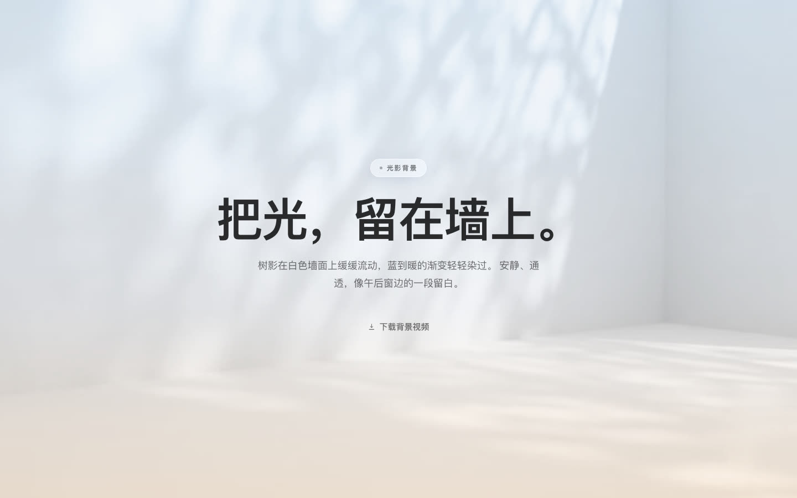

# 光影背景 · 单页复刻

一个用纯 HTML/CSS/JS 复刻 [today.ai/thanks](https://today.ai/thanks?platform=macAppleSilicon) 背景氛围的单页。核心是把「白墙树影视频 + 渐变染色」这套叠层玩法拆出来复用 —— 单文件、零依赖、零构建。

<p align="center">
  
</p>

## 背景原理

那面白墙看起来像「贴了层渐变」，其实是 **5 层叠加**的结果。少任何一层，通透感就没了：

| # | 图层 | 实现 |
|---|---|---|
| ① | 静态渐变打底 | `linear-gradient(180deg, #ACCDEC, #E7EBF4 61.54%, #FFDDB9)` |
| ② | 背景视频 | 白墙树影，`object-fit: cover` + `object-position: center top` |
| ③ | 海报图层 | 视频 `playing` 后 1000ms 淡出，做 crossfade 避免闪黑 |
| ④ | **染色层** | 同款渐变 @52% 透明 + `mix-blend-mode: color` |
| ⑤ | 白色薄纱 | `rgba(255,255,255,.28)`，把整体压柔 |

**关键在第 ④ 层。** `mix-blend-mode: color` 只取渐变的**色相与饱和度**，保留视频的**明度**。所以白墙不是被盖了一层半透明色块，而是真的被「染」成了蓝→暖 —— 树影的明暗层次一点没丢。这才是它看起来通透而不假的原因。

> 注意：`mix-blend-mode` 需要在父容器加 `isolation: isolate` 建立独立层叠上下文，否则混合会溢出影响其他元素。


## 目录结构

```
.
├── index.html          # 全部代码（HTML + CSS + JS，单文件）
├── assets/
│   ├── bg.webm         # 背景视频 382K
│   ├── bg.mp4          # 背景视频 1.8M（通用格式兜底）
│   └── bg-poster.jpg   # 首帧海报图（自动播放兜底）
└── docs/               # README 预览图
```

## 自定义

改文案：直接改 `<main class="content">` 里的内容，HTML 里标了注释。

换视频：替换 `assets/` 下三个文件，保持文件名不变即可。

换配色：只改 `:root` 里的 CSS 变量即可。

| 变量 | 作用 | 当前值 |
|---|---|---|
| `--bg-base` | ① 打底渐变 | `#ACCDEC → #E7EBF4 61.54% → #FFDDB9` |
| `--bg-tint` | ④ 染色层 | 同款渐变，`rgba(...,0.52)` |
| `--bg-veil` | ⑤ 白色薄纱 | `rgba(255,255,255,0.28)` |

> 染色层的透明度是**手感关键**：调高 → 颜色更足但视频纹理变淡；调低 → 纹理清晰但染色不明显。52% 是原站的取值。

## 特性

- **零依赖、零构建** —— 单 HTML 文件，直接丢静态托管就能跑
- **零外部请求** —— 不引 CDN、不请求第三方资源，无任何对外跳转链接，完全自包含
- **无障碍** —— 尊重 `prefers-reduced-motion`：隐藏视频、保留静态海报图
- **响应式** —— 桌面 1440×900 与移动 390×844 均已实测
- **自动播放兜底** —— 自动播放被浏览器拦截时保留海报图，首次点击后再唤起播放

## 浏览器兼容

`mix-blend-mode` 与 CSS 变量均为现代浏览器标准特性，Chrome / Edge / Firefox / Safari 等主流浏览器均支持。视频同时提供 webm 与 mp4 双源，浏览器自动择优。

## 说明

本项目仅复刻了背景视觉与叠层方案，原站的下载引导、应用图标、安装步骤图、导航栏等内容均已移除。

页面为**单一浅色主题**（原站该页本身即固定浅色，不跟随系统深色模式），故未提供深色变体。
